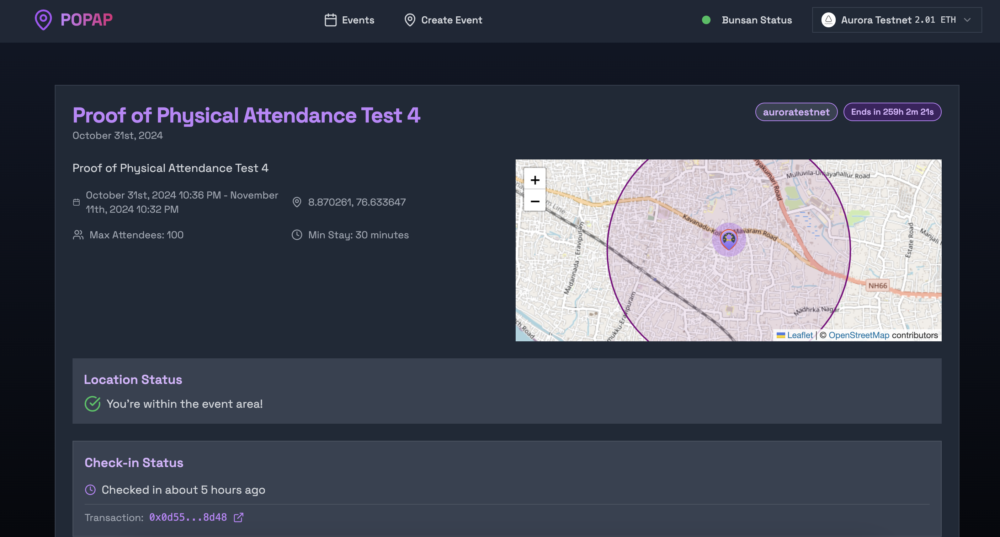
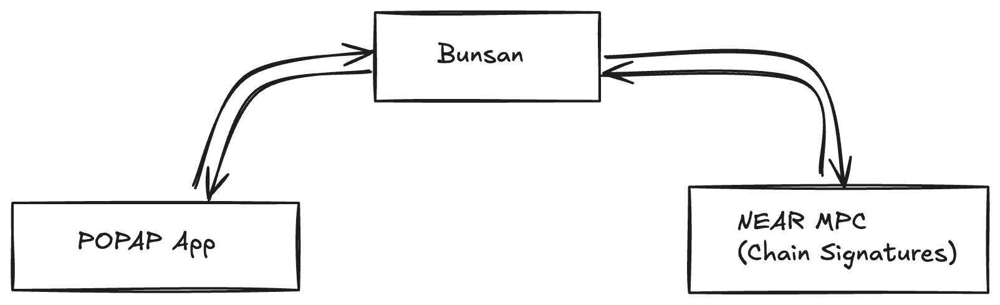

## Proof of Physical Attendance Protocol (PoPAP)

A protocol built that verifies and records physical attendance using blockchain technology.
This project implements a decentralized solution for confirming real-world presence at events or locations.



PoPAP uses a HTTP-based RPC loadbalancer named Bunsan that exposes endpoints for blockchain interactions.
The system provides a reliable way to verify physical attendance through blockchain technology, making it suitable for events, conferences, classes, and other scenarios requiring proof of presence.



The wallet management and signing is handled by NEAR MPC technology(Chain Signatures).
The interaction with the NEAR MPC technology is done by Busan endpoint via its extension `near-mpc-accounts`.

Busan is a RPC loadbalancer but supports extensions. `near-mpc-accounts` is the first Bunsan extension allowing Bunsan to handle Chain Signatures and other blockchain interactions on NEAR in a seamless way.

The PoPAP smart contract is written in Solidity and is present in `./contracts` folder which is a hardhat project itself. The contracts are programatically deployed from the UI using MPC powered wallets.
There is an auto-funder for the EVM chains. This should be set in the `.env` file.

## Prerequisites
Node.js 18.x or higher
npm/yarn/pnpm

## Getting Started

First, clone the repository

Install the dependencies:

```bash
npm install
# or
yarn install
# or
pnpm install
```

Run the development server:

```bash
npm run dev
# or
yarn dev
# or
pnpm dev
```

## License

This project is licensed under the MIT License.
